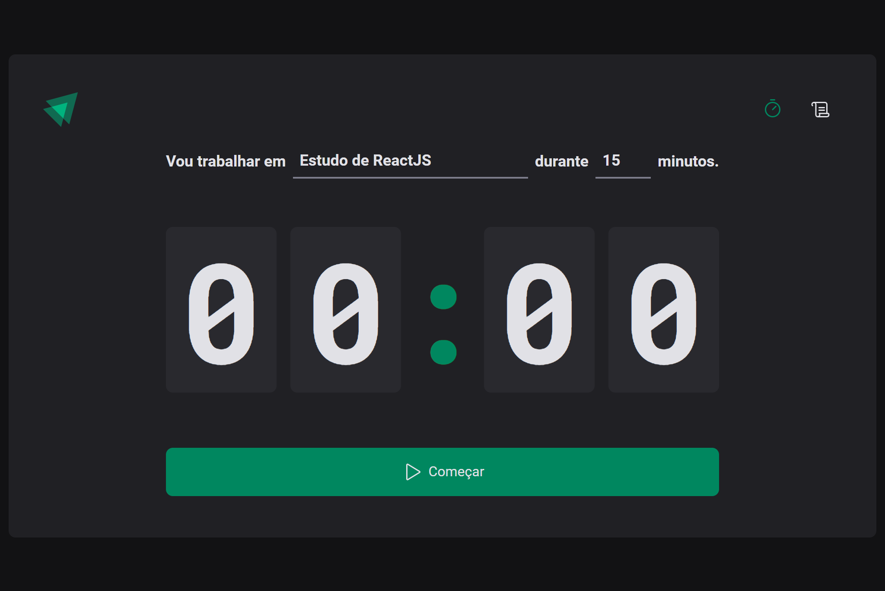
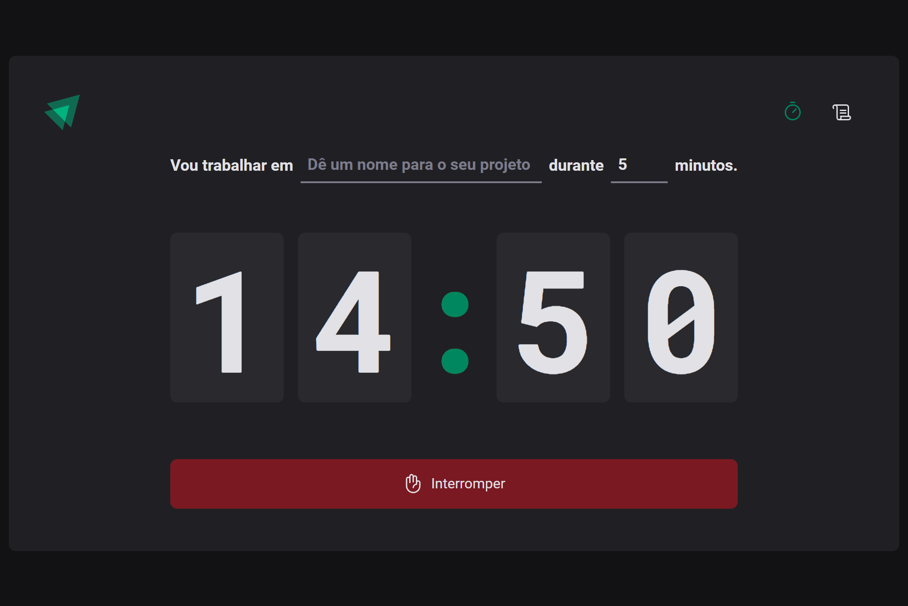
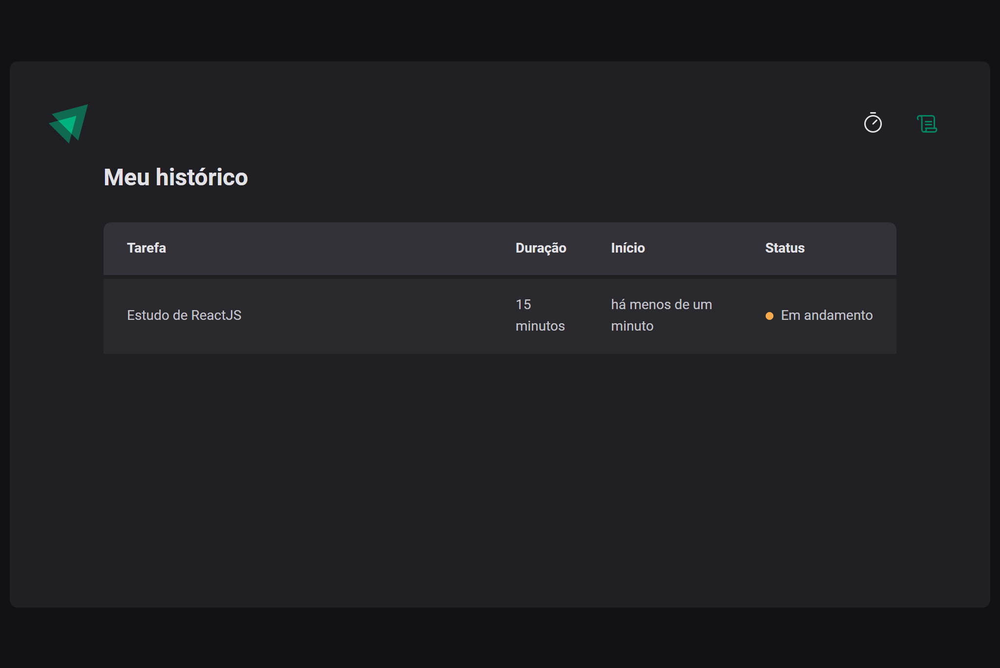

Eae, Dev! 👊🏾

Seja bem vindo(a) ✨🚀

<h1 align="center">Ignite Timer</h1>
<h3 align="center">Formação ReactJS - Rocketseat</h3>

  <a href="#-sobre">Sobre</a>&nbsp;&nbsp;&nbsp;|&nbsp;&nbsp;&nbsp;
  <a href="#-tecnologias">Tecnologias</a>&nbsp;&nbsp;&nbsp;|&nbsp;&nbsp;&nbsp;
  <a href="#-layout">Layout</a>&nbsp;&nbsp;&nbsp;|&nbsp;&nbsp;&nbsp;
  <a href="#-licença">Licença</a>&nbsp;&nbsp;&nbsp;|&nbsp;&nbsp;&nbsp;
  <a href="#-acesse-o-rocketseat-one">Acesse o Rocketseat One</a>

  

<h3>📌 Sobre</h3> 

Ignite Timer é o projeto prático da formação ReactJS, cujo objetivo é aplicar novos conceitos relacionados à rotas, formulários, hooks, contextos, reducers e muito mais.

<h3>📌 Tecnologias</h3> 

- React.js;
- TypeScript;
- HTML, CSS, JavaScript;
- Git;
- Figma;

<h3>📌 Layout</h3>

Você pode visualizar o layout do projeto através [DESSE LINK](https://www.figma.com/community/file/1127351821076435124/ignite-timer). É necessário ter conta no [Figma](https://figma.com) para acessá-lo.

<h3>📌 Licença</h3>

Esse projeto está sob a licença MIT.

<h3>📌 Acesse o Rocketseat One</h3>

[Rocketseat One](https://app.rocketseat.com.br/cart/rocketseat-one?referral=willian-moreno&utm_source=platform&utm_medium=organic&utm_campaign=venda&utm_term=mgm&utm_content=indication-lp_one)
